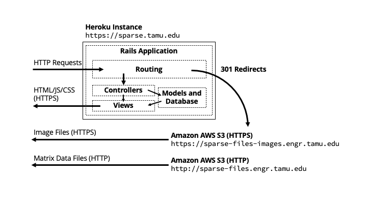
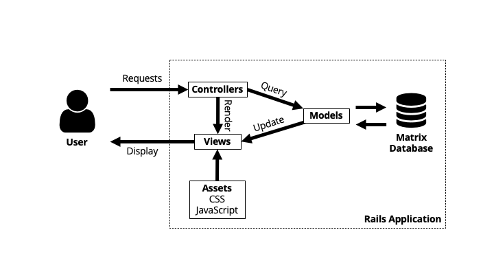
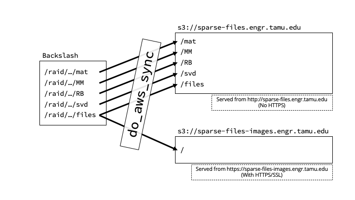

# Updating the SuiteSparse Matrix Collection Website

## Preliminaries

To update the SuiteSparse Matrix Collection Website, a short introduction to
the existing infrastructure is necessary.

### Website Development Infratructure

The SuiteSparse Matrix Collection Website has an open source development
infrastructure meant to catch bugs early and avoid bugs in production (i.e.
after deployment).

 * **GitHub.** The code for the website is maintained on GitHub at [github.com/ScottKolo/suitesparse-matrix-collection-website](https://github.com/ScottKolo/suitesparse-matrix-collection-website).
 * **Semaphore CI.** Semaphore CI (for Continuous Integration) runs the website's test suite after every push to GitHub. This ensures an independent system can run the website and it can function properly.
 * **Heroku (Test).** Once the website test suite passes on Semaphore CI, the website is automatically deployed on Heroku at [suitesparse-test.herokuapps.com](https://suitesparse-test.herokuapps.com). This allows the developer to check that the website is functioning as expected and renders correctly when deployed to an independent system.
 * **Heroku (Production).** When the developer feels confident that the website is ready for deployment, they can deploy manually to the production server on Heroku (suitesparse-collection-website). This production server is accessible through [sparse.tamu.edu](https://sparse.tamu.edu).

### Collection Webserver Infrastructure

The website requires three servers to work together.

 * **Heroku web application server.** The Rails application runs on Heroku.
 * **sparse-files.engr.tamu.edu.** The matrix data files (MATLAB, Matrix Market, Rutherford-Boeing, and SVD data) are served from an Amazon AWS S3 bucket without any HTTPS/SSL. These files are only accessible via HTTP.
 * **sparse-files-images.engr.tamu.edu.** The matrix image files are served from an Amazon AWS S3 bucket with HTTPS/SSL enabled. This enables images to be included in the website without a security warning.

### Ruby on Rails Application Infrastructure

While a full description of the inner workings of a Rails application is beyond the scope of this document, some explanation is necessary. Rails is a web application framework, meaning that it provides much of the necessary infrastructure for developing, deploying, and serving a website. You can think of Rails as a large configurable application that runs on a Ruby interpreter - and all of the website data, from HTML to CSS to Javascript, is all part of the Rails "configuration."

> **app**
> > **assets**
> > > Contains stylesheets, javascript files, and images that are preprocessed by Rails before being served (see Rails Asset Pipeline).
> > 
> > **controllers**
> > > The _C_ in MVC, controllers manage *what* should be displayed on the page. The controller manages what data should be sent to the view (usually which matrices are in the index list, or what matrix's details are being displayed).
> > 
> > **helpers**
> > > A set of helper functions that can be used in the models, views, and/or controllers.
> > 
> > **mailers**
> > > Mailers manage how emails are sent from the website. In this case, only one mailer (`AdminiNotifierMailer`) exists to notify Dr. Davis when a new matrix has been submitted.
> > 
> > **models**
> > > The _M_ in MVC, models manage database queries from the controllers.
> > 
> > **views**
> > > The _V_ in MVC, views manage *how* content should be displayed on the page. The views for this site are written in HAML, an HTML metalanguage.
>
> **config**
> > The config folder contains all application configuration information. Generally, this should not be edited, but from time to time (e.g. upgrades to Rails or Ruby) modifications are required, especially as the Rails default configuration has been known the change.
> 
> **db**
> > The database configuration folder. The schema is stored here, as well as any database migrations. Also, the database seed script (`seeds.rb`) is stored here, which will populate an empty database when `rake db:seed` is called.
> 
> **features**
> > Cucumber BDD tests are stored in features. As new features are added to the website, new tests should be added in this folder.
> 
> **public**
> > The public folder is publicly visible, and usually serves to store precompiled assets and other files that are sent directly to the client.
> 
> **Gemfile**
> > The Gemfile contains a list of required dependencies and versions. After ANY modification to the Gemfile, you should always run `bundle install` to allow bundler to upgrade/install any gems necessary, as well as to regenerate Gemfile.lock.

## General Process for Updating the SuiteSparse Matrix Collection Website

 * Pull the latest version of the code from GitHub.
 * Make the changes to the code.
 * Run the test suite.
 * Push the changes to the GitHub repository.
 * See if the test suite passes on Semaphore.
 * Check the test website on Heroku.
 * Manually deploy to Heroku production.

Note that "code" for the website refers to everything within the Rails application folder, including the database seed data. In other words, the process for modifying and deploying the website is essentially the same whether the changes are to the website code or database code.

### Pull the latest version of the code from GitHub.

If you do not currently have a git repository set up locally, then you will need to clone the repository onto your computer.

`git clone https://github.com/ScottKolo/suitesparse-matrix-collection-website.git`

If you already have a git repository set up locally for the website, simply execute `git pull`.

### Make the changes to the code.

Within the local git repository, you can make changes to the website. 

### Run the test suite.

After making any changes to the code, the first check that nothing has been broken is to run the test suite locally. It is also good practice to add tests before making any changes (test-driven development).

The easiest way to run the test suite locally is to navigate to the root
directory (`suitesparse-matrix-collection-website`) and run `rake`.
Additionally, it is a good idea to also run `brakeman`, which will check for
any obvious security errors.

If tests fail, you will need to go fix whatever the issue is (or modify the test if you feel everything is working as it should). Also note that "flaky" tests (tests that may pass or fail under the same configuration - e.g. race conditions or other timing issues) should be fixed.

Once all tests are passing locally, you can proceed to the next step.

### Push the changes to the GitHub repository.

When you're ready to commit your changes, you can `git push` the changes to GitHub.

### See if the test suite passes on Semaphore.

Navigate to [semaphoreci.com/scottkolo/suitesparse-matrix-collection-website](https://semaphoreci.com/scottkolo/suitesparse-matrix-collection-website) to check the status of the continuous integration build. If this build fails, something may be cached on your system that is not on the independent server. You should troubleshoot this issue before proceeding, then push your changes to GitHub again.

### Check the test website on Heroku.

Once the tests on Semaphore are passing, the web application will be automatically deployed to Heroku at [suitesparse-test.herokuapp.com](https://suitesparse-test.herokuapp.com). This deployment environment is almost identical to the production environment, so problems here will almost certainly be present in production. If everything looks and works correctly, then it's time to deploy to production.

### Manually deploy to Heroku production.

Once you are confident that the website is ready for deployment, you can then manually deploy the application to the production Heroku instance.

 * First, log into Heroku. You will need to be part of the **tamu-cse** team and have access to the **suitesparse-collection-website** app.
 * Navigate to the **Deploy** tab.
 * At the bottom of the page, under **Manual Deploy**, make sure the master branch is selected, and then click on **Deploy Branch**.

The deployment process will automatically pull the latest application code from GitHub, deploy it on Heroku in the production environment, and reset the database with the seed values. This can take a few minutes. If everything has succeeded, you should be able to navigate to [sparse.tamu.edu](https://sparse.tamu.edu) and see the newly deployed website.

# Troubleshooting Deployment

Here are some common problems that may occur when deploying the website.

* **The styelsheets and javascript are missing.** This indicates a problem with the Rails asset pipeline. You may need to call `rails assets:precompile` to precompile the assets, or check the settings in the `config` directory.
* **I see two (or more) copies of every matrix.** This is likely caused by calling `rails db:seed` without resetting the database. Many Rails applications have large databases that should not be reset often, but for this application, resetting the database is trivial. Running `rails db:reset` will clear the old database and rebuild it, fixing this issue. Alternatively, check the contents of `db/collection_data` to ensure that there are no erroneous duplicate files.
    - Heroku does not give applications permission to do a total `db:reset`, so to reset the database, you need to run `rails db:schema:load db:seed`. This should be done automatically upon deployment (see `/Procfile`).
* **I receive an error about a migration or schema problem.** Running `rake db:reset` should fix this. If this problem is on Heroku, `db:reset` is not allowed, so try resetting the database and running `rails db:schema:load` to load the schema manually.
    - Again, the database should be reset automatically upon deployment (see `/Procfile`).
* **My tests sometimes fail on Semaphore.** You may have a flaky test. Look into making the test more consistent, or, in the worst/lazy case, you may need to add a delay during the test (e.g. after a new filter has been applied, allowing time for the interface to update).
* **I get a reddish "Something went wrong" page.** Check the logs. If working locally, check `/log/development.log`, and if you're working on Heroku, click on the **More** dropdown in the top right corner of the Heroku dashboard and select **View logs**.
* **I get some `Gemfile` / `Gemfile.lock` error.** Most likely, you forgot to run `bundle install` after modifying the Gemfile. This is important, since `Gemfile.lock` is also generated when `bundler install` runs. If the `Gemfile.lock` file is outdated compared to the `Gemfile`, you will receive an error. Another issue that can come up is that you have specified an impossible set of versions (e.g. < 2.0 and > 3.1). If you have recently edited the versions of the gems in the `Gemfile`, this could be the problem, and you will need to revise those dependencies by either upgrading or downgrading your dependencies in your `Gemfile`.

# Updating the Matrix Database

Updates to the matrix database because new matrices have been added to (or removed from...?) the collection are treated just like any other change to the website. The same process described above should be followed.

## Updating Matrix Database

The matrix (and group) data is stored in `db/collection_data`. It is part of the application code and stored in the GitHub repository. Modifying `collection_data` directly is not recommended - it can instead be generated automatically using `ssdbgen.m`. The general process for updating `collection_data` is described below:

 * Update the canonical collection up to and including the point where `ssstats.csv` is generated.
 * Log into Backslash
 	- Any computer with MATLAB installed and access to a complete copy of the collection should suffice, but for very large matrices, it may require Backslash to be able to compute the relevant statistics.
 * Start MATLAB, navigate to the `db/` folder, and run `ssdbgen` in MATLAB.
 	- Note that `ssget` should be in your path, and it should be pointing to a complete local verison of the collection (see `ssget_defaults.m`).
 * Once `ssdbgen` has finished, the `db/collection_data` directory will have been overwritten with the new matrix collection database data.

## Updating Matrix Data and Image Files

After new matrices are added, new image and data files will also need to be uploaded to their corresponding Amazon AWS S3 buckets. On Backslash, navigate to `/raid/SuiteSparseCollection` ...

 * `do_aws_sync` will synchronize the directories `mat`, `MM`, `RB`, and `files` in `/raid/SuiteSparseCollection/html` with the `sparse-files.engr.tamu.edu` S3 bucket. It will also synchronize the `files` directory with the `sparse-files-images.engr.tamu.edu` S3 bucket. Note that this will also delete files on the S3 bucket that are no longer present.
 * `do_aws_sync_dryrun` will compute a dry run of `do_aws_sync` and display the expected upload/delete operations.

From this point, you can treat the above changes like any other change and start from "Make Changes to the Code" above.
